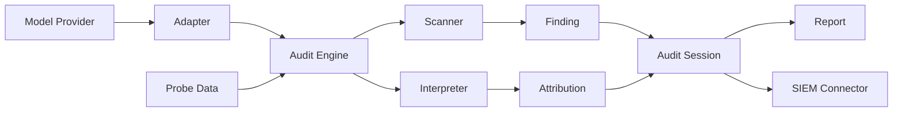

[](https://github.com/Anandhasasidharan/community-ai-audit/actions)
[](https://pypi.org/project/community-ai-audit/)
[](https://pypi.org/project/community-ai-audit/)
[](LICENSE)
[](https://codecov.io/gh/Anandhasasidharan/community-ai-audit)

# Community AI Audit

**A plugin-driven framework for auditing AI model behavior across providers and deployment targets.**

Run the same backdoor detection scan against an OpenAI GPT-4o endpoint, a local PyTorch model, or a HuggingFace transformer — without changing the scanner. Push findings to Splunk, Elastic, Datadog, or Sentinel with one configuration entry.

---

## The Problem

AI model auditing today is fragmented:

- **Per-provider tooling** — OpenAI's safety tooling works on OpenAI models. Anthropic's works on Claude. No shared infrastructure.
- **Manual evidence collection** — Auditors run ad-hoc scripts, save results to files, manually correlate findings. No standard format.
- **No repeatable pipeline** — An audit performed today cannot be reproduced identically next week because the tooling changes between runs.

This works for one-off assessments. It does not scale to continuous evaluation across a model portfolio.

---

## What Community AI Audit Does

The framework separates three concerns:

1. **Model access** — adapters that speak each provider's protocol
2. **Evidence collection** — scanners and interpreters that produce structured findings
3. **Output routing** — reporters and SIEM connectors that deliver results where they're needed

| Capability | Description |
|------------|-------------|
| **Provider-independent scanning** | Run the same scanner against any supported model provider |
| **Structured findings** | Every finding includes severity, confidence, evidence, and recommendation |
| **Pluggable architecture** | Add a provider, scanner, or SIEM target by writing one class |
| **CI/CD integration** | Push audit findings to production SIEM pipelines automatically |
| **Reproducible audits** | Session-based audit runs with versioned scanner and adapter metadata |

---

## How It Works



**Adapter** translates provider-specific model access into a uniform interface.  
**Scanner** applies a detection technique (e.g., activation clustering, adversarial perturbation).  
**Interpreter** attributes model outputs to inputs.  
**Audit Session** collects all findings, computes risk scores, and routes output.  
**Connector** pushes results to external systems.

---

## Example Audit

### Input

A probe dataset and a model identifier:

```bash
community-ai-audit scan ./model.pt \
  --provider local \
  --scanners backdoor adversarial \
  --probe-file probes.json
```

### Output

```json
{
  "session_id": "a1b2c3d4-e5f6-7890-1234-567890abcdef",
  "model_id": "model.pt",
  "adapter": "local",
  "scanners": [
    {
      "scanner": "backdoor",
      "severity": "high",
      "risk_score": 72.3,
      "findings": [
        {
          "title": "Activation cluster deviation detected in layer 3",
          "description": "Neuron activations deviate >2σ under trigger pattern",
          "severity": "high",
          "confidence": 0.87,
          "evidence": "Cluster centroid shift: 1.84 (baseline) vs 4.21 (triggered)",
          "recommendation": "Inspect training pipeline for data poisoning"
        }
      ]
    },
    {
      "scanner": "adversarial",
      "severity": "medium",
      "risk_score": 41.5,
      "findings": [
        {
          "title": "FGSM perturbation reduces accuracy by 34%",
          "severity": "medium",
          "confidence": 0.92,
          "evidence": "Accuracy drop: 0.91 → 0.57 at ε=0.05"
        }
      ]
    }
  ],
  "risk_score": 56.9,
  "risk_level": "medium"
}
```

### What this means

The model shows high-confidence evidence of backdoor behavior (cluster deviation with trigger pattern) and moderate adversarial vulnerability. The 95-line config pushed these findings to a configured SIEM. The structured format enables automated triage.

---

## Quick Start

```bash
pip install community-ai-audit

# Verify installation
community-ai-audit discover

# Full audit (local model, requires torch)
pip install "community-ai-audit[torch]"
community-ai-audit audit ./model.pt \
  --provider local \
  --scanners backdoor adversarial \
  --interpreters integrated-gradients \
  --probe-file probes.json \
  --output json \
  --save audit-report.json
```

### Configuration

Credentials and settings are read from environment variables, a YAML config file, or CLI flags:

```bash
export SPLUNK_TOKEN="your-token"
export SPLUNK_HOST="https://hec.splunk.example.com:8088"

community-ai-audit audit ./model.pt \
  --provider local \
  --scanners backdoor \
  --connectors splunk event-log
```

See [config/default.yaml](config/default.yaml) for all available options.

---

## Supported Providers

| Provider | Adapter | Model Types | Requires |
|----------|---------|-------------|----------|
| HuggingFace | `huggingface` | Text, Image, Multimodal | `pip install "community-ai-audit[torch,hf]"` |
| OpenAI | `openai` | Text | `OPENAI_API_KEY` |
| Anthropic | `anthropic` | Text | `ANTHROPIC_API_KEY` |
| AWS Bedrock | `aws_bedrock` | Text, Image | AWS credentials |
| Local (PyTorch) | `local` | Any | `pip install "community-ai-audit[torch]"` |
| Ollama | `ollama` | Text | Running Ollama server |

### SIEM Connectors

| Target | Connector | Auth |
|--------|-----------|------|
| Splunk HEC | `splunk` | Token |
| Elastic Security | `elastic` | API Key |
| Datadog Logs | `datadog` | API Key |
| Microsoft Sentinel | `sentinel` | Workspace Key |

---

## Project Structure

```
community-ai-audit/
│
├── community_ai_audit/       # Package source
│   ├── adapters/             # Model provider adapters (6 built-in)
│   ├── connectors/           # SIEM connectors (4 built-in)
│   ├── core/                 # Engine, interfaces, registry
│   ├── plugins/              # Scanners, interpreters, reporters
│   └── reporting/            # Report generator and formats
│
├── config/                   # Default YAML configuration
├── docs/                     # Architecture, guides, decisions
├── examples/                 # Runnable examples for each component type
├── tests/                    # Test suite (48 tests)
│
├── pyproject.toml
└── README.md
```

---

## Design Principles

**Reproducibility.** Every audit run is bound to a session ID with versioned scanner and adapter metadata. A run can be reconstructed from the session record alone.

**Evidence-first findings.** Every finding includes machine-verifiable evidence (cluster centroids, perturbation vectors, attribution scores) — not just severity labels.

**Provider independence.** Scanners operate on the `ModelAdapter` interface, not on specific provider SDKs. The same backdoor scanner works across all 6 adapters without modification.

**Modularity.** Adding a new provider, scanner, or SIEM target requires writing one class and registering it. No changes to the engine. See the [contributor guides](docs/) for ~30-minute walkthroughs.

**Transparency.** The plugin registry is inspectable at runtime. All discovered components, their versions, and their registered capabilities are visible via the CLI.

---

## Current Limitations

- Scanners that require gradient access (adversarial, integrated gradients) work only with adapters that expose model internals (`local`, `huggingface`). API-only adapters (`openai`, `anthropic`, `ollama`) support black-box scanning only.
- SIEM connectors require live credentials. There is no offline or dry-run mode for connector dispatch.
- Scanners are implemented in PyTorch. TensorFlow support is available via the `tf` optional dependency but remains untested in CI.
- The CLI uses Unicode box-drawing characters, which do not render correctly in Windows Command Prompt without `PYTHONUTF8=1`.
- Coverage targets 40% — adapters, scanners, and interpreters that require model dependencies (torch, transformers) are tested with mock objects rather than real model weights.

---

## Roadmap

**Near-term (v0.2)**
- Performance benchmarking with latency/throughput tracking
- Batch scan mode for evaluating multiple models
- Parallel connector dispatch
- Caching layer for repeated model queries

**Medium-term (v0.3–v0.4)**
- Additional providers: Google Vertex AI, Groq, Replicate
- Prompt injection and memorization scanners
- Custom scanner DSL for security researchers
- Docker compose for local evaluation

**Long-term (v0.5+)**
- Kubernetes Helm chart for deployment
- Air-gapped installation
- Scheduled recurring audits
- Multi-user role-based access

See [ROADMAP.md](ROADMAP.md) for the full plan.

---

## Contributing

Adding a new component takes approximately 30 minutes:

- [Adapter Guide](docs/ADAPTER_GUIDE.md) — add a model provider
- [Scanner Guide](docs/SCANNER_GUIDE.md) — add a detection technique
- [Connector Guide](docs/CONNECTOR_GUIDE.md) — add a SIEM target
- [Interpreter Guide](docs/INTERPRETER_GUIDE.md) — add an attribution method

All contributions should pass `ruff check .`, `black --check .`, and add tests where possible. See [CONTRIBUTING.md](CONTRIBUTING.md) for the full workflow.

---

## License

MIT. See [LICENSE](LICENSE).
