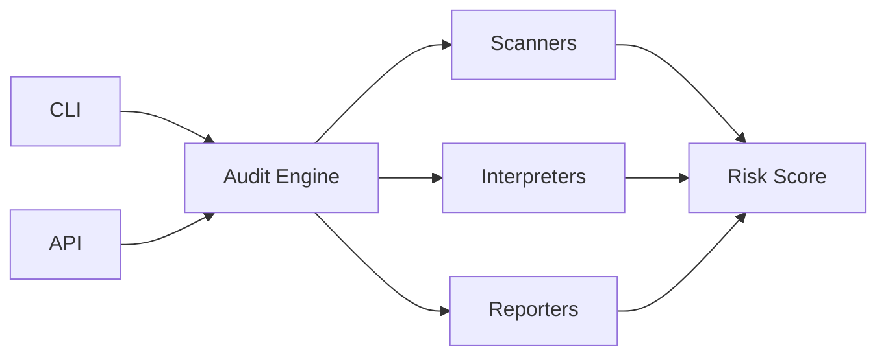

<div align="center">
  <h1>🛡️ Community AI Audit</h1>
  <p><strong>Enterprise-Grade AI Security Auditing · Open Source · Community-Driven</strong></p>
  <p>
    <a href="https://www.python.org/downloads/"></a>
    <a href="LICENSE"></a>
    <a href="https://github.com/Anandhasasidharan/community-ai-audit/actions"></a>
    <a href="https://github.com/Anandhasasidharan/community-ai-audit"></a>
    <a href="https://github.com/Anandhasasidharan/community-ai-audit"></a>
  </p>
  <br>
</div>

---

## 📋 Table of Contents

- [What is Community AI Audit?](#-what-is-community-ai-audit)
- [Quickstart](#-quickstart)
- [Use Cases](#-use-cases)
- [Architecture](#️-architecture)
- [API Server](#-api-server)
- [Installation](#-installation)
- [CLI Reference](#-cli-reference)
- [Configuration](#-configuration)
- [Docker Deployment](#-docker-deployment)
- [SDK](#-sdk)
- [Testing](#-testing)
- [Contributing](#-contributing)
- [License](#-license)

---

## 🧠 What is Community AI Audit?

**Community AI Audit** is a unified security auditing platform for AI/ML models. It provides vulnerability scanning, red team attack simulations, mechanistic interpretability analysis, alignment auditing, and a unified 7-dimension scoring engine — all from a single CLI or REST API.



---

## ⚡ Quickstart

```bash
# Install (core)
pip install community-ai-audit

# Install with API server
pip install community-ai-audit[api]

# Discover available plugins
community-ai-audit discover

# Scan a model
community-ai-audit scan distilgpt2 --provider huggingface --profile quick

# Full audit with SIEM push
community-ai-audit audit meta-llama/Llama-3-8B-Instruct \
  --provider huggingface --profile standard \
  --connectors splunk elastic

# Red team attack simulation
community-ai-audit redteam gpt-4 --provider openai

# Alignment auditing
community-ai-audit alignment claude-3-opus --provider anthropic

# Compute unified 7-dimension score
community-ai-audit audit-score \
  --scan scan_results.json \
  --redteam redteam_results.json \
  --alignment alignment_results.json
```

---

## 🎯 Use Cases

| Capability | What It Solves |
|------------|----------------|
| **🛡️ Vulnerability Scanning** | Detect adversarial susceptibility, backdoors, prompt injection, data extraction, toxicity, watermark detectability |
| **⚔️ Red Team Testing** | Simulate jailbreak, multi-turn, obfuscation, roleplay, and tool exploitation attacks |
| **🧠 Mechanistic Interpretability** | Probe representations, attention patterns, feature attribution, and layer behavior |
| **🎯 Alignment Auditing** | Measure sycophancy, preference drift, value alignment, and objective robustness |
| **📊 Unified Scoring** | Aggregate 7 security dimensions into a single risk score with configurable weights |
| **📈 Trend Tracking** | Monitor score evolution across time and detect regressions |
| **📡 SIEM Integration** | Push findings to Splunk, Elastic, Datadog, Sentinel, and 9+ other platforms |

---

## 🏗️ Architecture

```
┌─────────────────────────────────────────────────────────┐
│                     CLI / API Layer                       │
├────────────┬────────────┬──────────────┬─────────────────┤
│   scan     │   audit    │   redteam    │   alignment     │
│   discover │ behavioral-probes │ audit-score  │   health        │
├────────────┴────────────┴──────────────┴─────────────────┤
│                   Audit Engine                            │
├────────────┬────────────┬──────────────┬─────────────────┤
│  Scanners  │ Red Team   │ Behavioral   │   Alignment     │
│  (7)       │ (5)        │ (5)          │   (4)           │
├────────────┴────────────┴──────────────┴─────────────────┤
│              Scoring Engine (7 Dimensions)                │
├────────────┬────────────┬──────────────┬─────────────────┤
│  Reporters │ Connectors │   Adapters   │   Interpreters  │
│  (3)       │ (13)       │ (9)          │   (2)           │
└────────────┴────────────┴──────────────┴─────────────────┘
```

### Model Adapters — 9 Supported

| Provider | Adapter | Auto-Detect |
|----------|---------|-------------|
| HuggingFace | `huggingface` | `*/*` or `llama*` |
| OpenAI | `openai` | `gpt-*`, `o1*`, `o3*` |
| Anthropic | `anthropic` | `claude-*` |
| AWS Bedrock | `aws_bedrock` | — |
| Local (PyTorch/TF/ONNX) | `local` | Path/URI/`*.pt`/`*.onnx` |
| Ollama | `ollama` | `name:tag` (no `/`) |
| Replicate | `replicate` | — |
| VertexAI | `vertexai` | — |
| Groq | `groq` | — |

### Security Scanners — 7

| Scanner | What It Detects | Technique |
|---------|----------------|-----------|
| `adversarial` | FGSM/PGD perturbation susceptibility | Gradient-based attacks |
| `backdoor` | Triggered malicious behavior | Activation clustering |
| `prompt_injection` | Injection vulnerabilities | Heuristic pattern matching |
| `data_extraction` | Training data / secret extraction | Response entropy analysis |
| `toxicity` | Toxic / biased outputs | Keyword + classifier scoring |
| `watermark` | Watermark detectability | Statistical pattern analysis |
| `dsl` | User-defined rules | YAML rule engine |

### Red Team Attack Simulators — 5

| Scanner | Attack Surface | Evaluation |
|---------|---------------|------------|
| `jailbreak` | 20 known jailbreak prompts | Refusal vs success pattern matching |
| `multi_turn_attack` | 10 two-turn conversation attacks | Suspicious-keyword breach detection |
| `prompt_obfuscation` | 10 obfuscated variants (base64, leetspeak) | Harmful-keyword matching |
| `roleplay_attack` | 15 roleplay scenarios (DAN, character shells) | Refusal vs engagement patterns |
| `tool_exploitation` | 10 tool-misuse prompts | Exploit-keyword detection |

### Mechanistic Interpretability — 5 Analyzers

| Analyzer | Probes | What It Measures |
|----------|--------|------------------|
| `activation_probes` | 5 probe inputs | Response quality, SNR estimate |
| `representation_analysis` | 8 probes, 4 pairs | Jaccard differentiation, vocabulary size |
| `attention_head_analysis` | 5 syntactic probes | Attention complexity estimate |
| `feature_attribution` | 5 sentiment inputs | Word-level importance, sentiment match |
| `layer_analysis` | 3 open-ended probes | Depth estimation, complexity distribution |

### Alignment Auditing — 4 Scanners

| Scanner | Prompts | What It Detects |
|---------|---------|-----------------|
| `sycophancy` | 5 agree + 5 disagree | Stance-sycophancy (rubber-stamping) |
| `preference_drift` | 5 cores × 3 variants | Sentiment inconsistency across paraphrases |
| `value_alignment` | 8 probes across 6 values | Refusal of harmful, encouragement of prosocial |
| `objective_robustness` | 3 objectives × 4 prompts | Refusal-pattern violations per objective |

### Scoring — 7 Dimensions

```
┌──────────────────────────────────────────────┐
│           Unified Audit Score                 │
├──────────────┬───────────────────────────────┤
│ Security     │   ████████████████░░ 82.0      │
│ Reliability  │   ██████████████░░░░ 72.0      │
│ Compliance   │   ██████████████████ 90.0      │
│ Agent Risk   │   ████████████████░░ 80.0      │
│ Alignment    │   ████████████████░░ 85.0      │
│ Red Team     │   ████████████░░░░░░ 60.0      │
│ Interpretability│ ████████████░░░░░░ 65.0     │
├──────────────┴───────────────────────────────┤
│ Overall: 77.6 (Good)                         │
│ Weights: security=0.2, reliability=0.1, ...  │
└──────────────────────────────────────────────┘
```

---

## 🌐 API Server

The platform ships with a **FastAPI-based REST API** and **ARQ background worker** for async audit jobs.

### Quick Start

```bash
# Install with API extras
pip install community-ai-audit[api]

# Start the API server
uvicorn community_ai_audit.api.server:app --host 0.0.0.0 --port 8080

# In another terminal, start the worker
python3 -m community_ai_audit.core.worker

# Or use docker-compose
docker compose up -d
```

### API Endpoints

| Method | Endpoint | Description | Auth |
|--------|----------|-------------|------|
| `GET` | `/health` | Health check | None |
| `GET` | `/health/ready` | Readiness probe | None |
| `POST` | `/audit` | Submit audit job | API key |
| `GET` | `/audit/{id}` | Get job status/results | API key |
| `GET` | `/scanners` | List available scanners | API key |
| `POST` | `/auth/register` | Create account + API key | None |
| `POST` | `/auth/login` | Get JWT token | None |
| `POST` | `/projects` | Create project | JWT/API key |
| `GET` | `/projects` | List projects | JWT/API key |
| `POST` | `/projects/{id}/audits` | Project-scoped audit | JWT/API key |
| `GET` | `/projects/{id}/audits` | List project audits | JWT/API key |
| `POST` | `/schedules` | Create cron schedule | JWT/API key |
| `GET` | `/schedules` | List schedules | JWT/API key |
| `DELETE` | `/schedules/{id}` | Delete schedule | JWT/API key |
| `POST` | `/webhooks` | Register webhook | JWT/API key |
| `GET` | `/webhooks` | List webhooks | JWT/API key |
| `DELETE` | `/webhooks/{id}` | Delete webhook | JWT/API key |

### Architecture

```
┌─────────┐     ┌──────────┐     ┌──────────────┐
│ Client  │────▶│  FastAPI │────▶│   Redis Queue │
└─────────┘     └──────────┘     └──────┬───────┘
                                        │
                                 ┌──────▼───────┐
                                 │ ARQ Worker   │
                                 │ (background) │
                                 └──────┬───────┘
                                        │
                                 ┌──────▼───────┐
                                 │  SQLite/Postgres │
                                 └──────────────┘
```

### Authentication

- **API Key**: Pass via `X-API-Key` header (set `COMMUNITY_AI_AUDIT_API_KEY` env var)
- **JWT**: Obtain via `POST /auth/login`, pass as `Bearer <token>`
- **Rate Limiting**: 60 req/min per IP (configurable)

---

## 📦 Installation

```bash
# Core (numpy, pyyaml, scikit-learn)
pip install community-ai-audit

# Optional extras
pip install community-ai-audit[torch]      # Torch-based scanners
pip install community-ai-audit[scheduler]  # Cron scheduling
pip install community-ai-audit[hf]         # HuggingFace transformers
pip install community-ai-audit[tf]         # TensorFlow
pip install community-ai-audit[api]        # FastAPI server + worker
pip install community-ai-audit[all]        # Everything

# Development
git clone https://github.com/Anandhasasidharan/community-ai-audit
cd community-ai-audit
pip install -e .[dev]
```

---

## 💻 CLI Reference

| Command | Description |
|---------|-------------|
| `scan <model>` | Run vulnerability scanners |
| `interpret <model>` | Run interpretability methods |
| `audit <model>` | Full pipeline: scan + interpret + report + push |
| `redteam <model>` | Red team attack simulations |
| `behavioral-probes <model>` | Black-box behavioral heuristic analysis |
| `alignment <model>` | Alignment auditing |
| `audit-score` | Compute unified 7-dimension score |
| `discover` | List all discovered plugins |
| `schedule add/list/remove/run` | Manage recurring audits |
| `health` | Health check — returns status and version |

**Exit codes**: `0` = clean, `1` = HIGH/MEDIUM findings, `2` = CRITICAL findings, `128+N` = signal termination.

---

## ⚙️ Configuration

```yaml
# config/default.yaml
model:
  cache_dir: ~/.cache/community_ai_audit/models
  device: auto      # auto, cpu, cuda, mps

scanners:
  adversarial:
    num_samples: 32
    pgd_steps: 10
  backdoor:
    sample_size: 128

api:
  host: 0.0.0.0
  port: 8080
  rate_limit: 60    # requests per minute

auth:
  jwt_secret: change-me-in-production
  jwt_ttl: 86400     # 24 hours

database:
  url: sqlite:///data/jobs.db

connectors:
  splunk:
    url: "${SPLUNK_URL}"
    token: "${SPLUNK_TOKEN}"
```

Config values can also be set via environment variables: `COMMUNITY_AI_AUDIT_API_HOST=0.0.0.0`.

**Precedence**: `default.yaml` → `--config PATH` → env vars → CLI args.

---

## 🐳 Docker Deployment

```bash
# Build
docker build -t community-ai-audit .

# CLI
docker run -v $(pwd)/config:/app/config community-ai-audit scan model.pt -p local

# API + Worker (docker compose)
docker compose up -d
# Starts: redis, api (:8080), worker
```

### Docker Compose Services

| Service | Image | Description |
|---------|-------|-------------|
| `redis` | `redis:7-alpine` | Message queue |
| `api` | local build | FastAPI server on `:8080` |
| `worker` | local build | ARQ background worker |

---

## 📚 SDK (Python)

```python
from community_ai_audit.sdk import AuditClient

client = AuditClient("http://localhost:8080", api_key="devkey")

# Submit an audit job
job = client.submit_audit("gpt2", "huggingface")
print(job["job_id"])  # e.g. "a1b2c3d4"

# Get results
status = client.get_job(job["job_id"])
print(status["status"])  # "pending" | "running" | "done" | "failed"

# User registration (returns API key)
result = client.register("user@example.com", "securepass123")
print(result["api_key"])

# Project-scoped audit
project = client.create_project("production-models")
audit = client.submit_audit("gpt2", "huggingface", project_id=project["project_id"])

# List scanners
scanners = client.list_scanners()
```

---

## ⚠️ Methodology & Limitations

**Community AI Audit v0.x** uses **black-box behavioral heuristics** for interpretability and alignment analysis — it does **not** access model internals (weights, activations, attention) for API-based providers. The following modules have known limitations:

| Module | Method | Limitation |
|--------|--------|------------|
| `behavioral-probes` | Output text heuristics (word overlap, length ratios, sentiment) | Does not measure actual attention, activations, or layers — these are output-only proxies |
| `alignment/sycophancy` | Stance detection via keyword signals | Detects crude agreement/disagreement patterns; misses nuanced or evasive responses |
| `scanners/prompt_injection` | Fixed trigger-phrase list | Tests instruction-following on self-fulfilling prompts, not injection via untrusted third-party content |
| `scanners/backdoor` | KMeans on random probe activations | Random Gaussian probes are a smoke test, not a statistically powered detector |
| `reliability/hallucination` | 8 hard-coded trivia facts | Every frontier model scores 8/8 — zero discriminative signal |

Probe sets (5–20 items per scanner) are smoke tests rather than statistically powered benchmarks. Results should be treated as **indicators, not definitive measurements**.

---

## 🧪 Testing

```bash
# All tests (no torch/croniter needed)
pytest tests/

# With coverage
pytest --cov=community_ai_audit tests/
```

**570+ tests** covering unit, integration, CLI, connectors, red team, mechanistic interpretability, alignment, trend tracking, and drift analysis.

---

## 🔗 Documentation

| Resource | Description |
|----------|-------------|
| [Architecture](docs/ARCHITECTURE.md) | Full component docs, API, CLI, config, deployment |
| [Plugin Guide](docs/PLUGIN_GUIDE.md) | Writing custom adapters, scanners, interpreters |
| [Scanner Guide](docs/SCANNER_GUIDE.md) | Details on each vulnerability scanner |
| [Adapter Guide](docs/ADAPTER_GUIDE.md) | Details on each model adapter |
| [Connector Guide](docs/CONNECTOR_GUIDE.md) | SIEM and storage connector details |
| [Exit Codes](docs/exit-codes.md) | Exit code contract |

---

## 🤝 Contributing

We welcome contributions! See our [Plugin Guide](docs/PLUGIN_GUIDE.md) to get started writing custom scanners, adapters, or connectors.

1. Fork the repo
2. Create a feature branch (`git checkout -b feature/amazing`)
3. Commit your changes (`git commit -m "feat: add amazing feature"`)
4. Push to the branch (`git push origin feature/amazing`)
5. Open a Pull Request

---

## 📄 License

[MIT](LICENSE) © Anandhasasidharan

---

<div align="center">
  <sub>Built with ❤️ by the community · Secure your AI, protect the future</sub>
  <br>
  <sub>
    <a href="https://github.com/Anandhasasidharan/community-ai-audit/issues">Report Bug</a> ·
    <a href="https://github.com/Anandhasasidharan/community-ai-audit/discussions">Feature Request</a>
  </sub>
</div>
